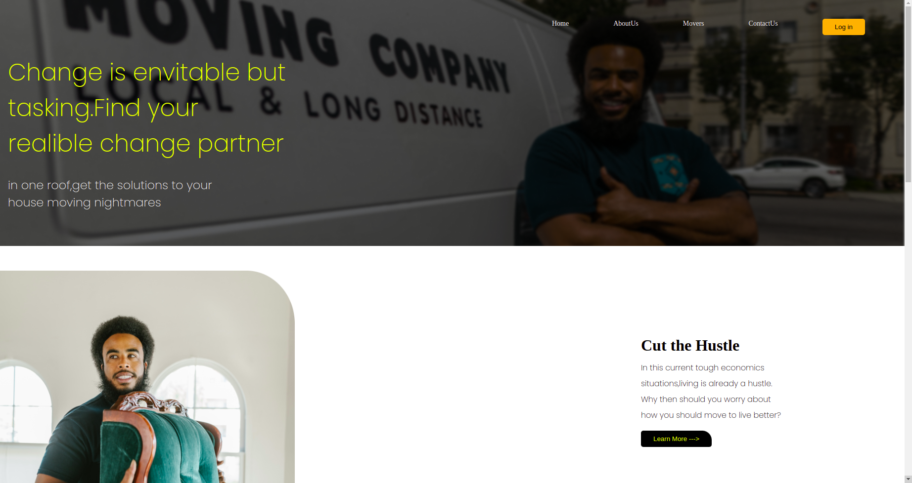

# week2project
quick movers web page
# Quick movers webpage
 ## By SIMON KAMAU
## Screenshot
 
 ## Table of Content
 - [Description](#description)
 - [Features](#features)
 - [Behaviour Driven Development](#Behaviour-Driven-Development)
 - [Requirements](#requirements)
 - [Installation Process](#installation-Process)
 - [Live Link](#Live-Link)
 - [Technology  Used](#technology-Used)
 - [Licence](#licence)
 - [Authors Info](#Authors-Info)
 ## Description
 
This project is a web application for Quick Movers webpage that shows details about the services it offers, has information about the school, the courses it offers and a portfolio about its mentors

[Go Back to the top](#week1-project)
## Features
As a user of the application,you will be able to :
1. See a description of what the services offered by the movers
1. Can enroll using a button placed at the top.
[Go Back to the top](#week1-project)
## Behaviour Driven Development|
| Behaviour      | Input        | Output       |
| :------------- | :----------: | -----------: |
|  Enter your name  |  Simon Kamau |     |
| Enter your Email Address  | mustaphasimon18@gmail.com |   |
| Enter your message or comment   |  I would like to inquire about something     |     |
| Press Submit|     |Pop up "Simon Kamau , we have received your message. Thank you for reaching out to us.|
[Go Back to the top](#week1-project)
 ###  Requirements
 * Access to  a computer or any other garget
 * Access to internet
 ### Installation Process
 ****
* Clone to their repo : git clone https://github.com/Mustie-THE-Dev/week2project.git
* Unzip the downloaded files in a folder of choice.
* Open the index file from the zipped file with any browser.
 ****
 [Go Back to the top](#week2project)
### Live Link
- Click this link to view the live application https://mustie-THE-Dev.github.io/week2project/
### Technology  Used
* HTML - which was used to develope the structure off the pages.
* CSS - which was used to style the User Interface.

[Go Back to the top](#week2project)
## Known Bugs
* Mailchimp API does not function correctly as expected.
## Licence
MIT License
Copyright (c) [2019] [Simon Kamau]
Permission is hereby granted, free of charge, to any person obtaining a copy
of this software and associated documentation files (the "Software"), to deal
in the Software without restriction, including without limitation the rights
to use, copy, modify, merge, publish, distribute, sublicense, and/or sell
copies of the Software, and to permit persons to whom the Software is
furnished to do so, subject to the following conditions:
The above copyright notice and this permission notice shall be included in all
copies or substantial portions of the Software.
THE SOFTWARE IS PROVIDED "AS IS", WITHOUT WARRANTY OF ANY KIND, EXPRESS OR
IMPLIED, INCLUDING BUT NOT LIMITED TO THE WARRANTIES OF MERCHANTABILITY,
FITNESS FOR A PARTICULAR PURPOSE AND NONINFRINGEMENT. IN NO EVENT SHALL THE
AUTHORS OR COPYRIGHT HOLDERS BE LIABLE FOR ANY CLAIM, DAMAGES OR OTHER
LIABILITY, WHETHER IN AN ACTION OF CONTRACT, TORT OR OTHERWISE, ARISING FROM,
OUT OF OR IN CONNECTION WITH THE SOFTWARE OR THE USE OR OTHER DEALINGS IN THE
SOFTWARE.
[Go Back to the top](#week2project)
## Authors Info
https://github.com/mustie-THE-dev
[Go Back to the top](#week1-project)
w
